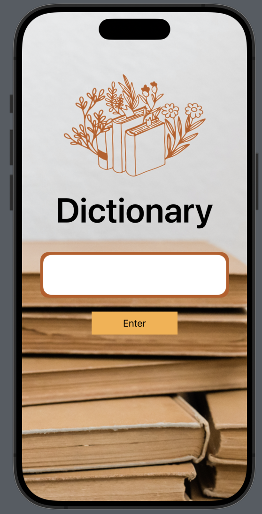
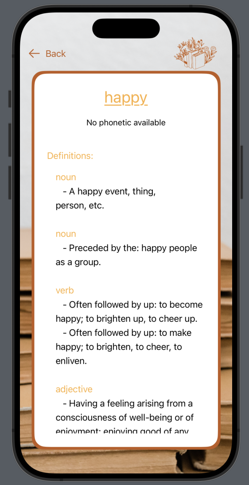

# iOS App: Dictionary

## Developer

Name-Surname: Chalisa Thummaraj

Student ID: 6410685041

## Information

### Description

แอพพจนานุกรมภาษาอังกฤษที่ช่วยขยายความหรือแสดงความหมายของคำศัพท์ภาษาอังกฤษ (en-en)

### Function

- พิมพ์คำศัพท์ที่ต้องการหา
  - กรณีไม่ได้พิมพ์จะไม่สามารถไปหน้าอธิบายคำศัพท์ได้
  - กรณีพิมพ์คำไม่ถูกต้องจะแสดงข้อความว่าเขียนผิด
  - กรณีมีคำศัพท์หรือพิมพ์ถูกจะแสดงข้อมูลทั้งหมด
- API ที่ใช้ : [Free Dictionary API](https://dictionaryapi.dev)

### Screen Shot

- Home Screen
  

- Definition

### Video

[Click here]()
